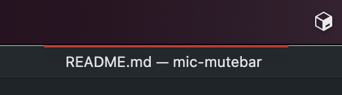
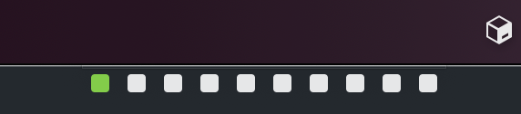

# mic-mutebar

This app show microphone status as simple bar.

This bar can be moved to anywhere.

## Installation

1. Download [latest binary](https://github.com/azu/mic-mutebar/releases/latest)
2. Open app

:warning: This app is not signed. So, OS show warning about it.

Additional installation steps on macOS:

1. Select `mic-mutebar.app`
2. Open context menu and Click "Open"

## Usage

When microphone is muted:

When microphone is inputing:

## Contributing

1. Fork it!
2. Create your feature branch: `git checkout -b my-new-feature`
3. Commit your changes: `git commit -am 'Add some feature'`
4. Push to the branch: `git push origin my-new-feature`
5. Submit a pull request :D

## License

MIT
